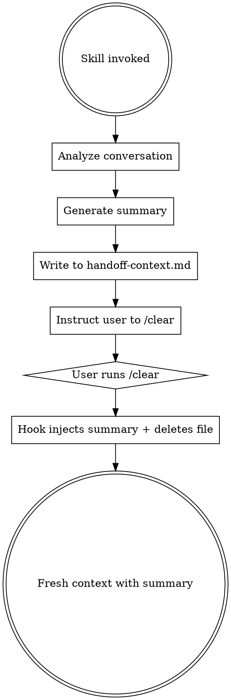

# Handoff

## Overview

Generates a concise summary of current work and prepares for context clearing. After running this skill, run `/clear` and the summary auto-injects into the fresh context.

## Workflow



## Summary Generation

Analyze the current conversation and create a summary covering:

1. **Current Task** - What are we working on? (1-2 sentences)
2. **Status** - What's completed, in progress, and blocked?
3. **Active Todos/Tasks** - Copy any TodoWrite items or Tasks if present
4. **Key Files** - Important files being modified (max 10)
5. **Key Decisions** - Important architectural/implementation decisions made
6. **Next Steps** - Immediate actions to take (numbered list)
7. **Relevant Docs** - Links to design docs, plans, or references

## Output Format

Write to `~/.claude/handoff-context.md`:

```markdown
# Handoff Context

## Current Task
[1-2 sentences describing what we're working on]

## Status
- **Completed:** [bullet list of what's done]
- **In Progress:** [current work item if any]
- **Blocked:** [any blockers, or "None"]

## Active Todos/Tasks
[Copy current todo list or task list if any, or "None"]

## Key Files
[List of important files, max 10]

## Key Decisions
[Important decisions made during this session]

## Next Steps
1. [First action]
2. [Second action]
...

## Relevant Docs
[Links to docs/plans, or "None"]
```

## Constraints

- Keep summary under 800 tokens
- Focus on actionable context, not conversation history
- Prioritize next steps over completed work
- Be specific about file paths and function names

## After Writing Summary

Tell the user:

> Handoff summary saved. Run `/clear` to continue with fresh context.
> The summary will be automatically injected and the file deleted.
